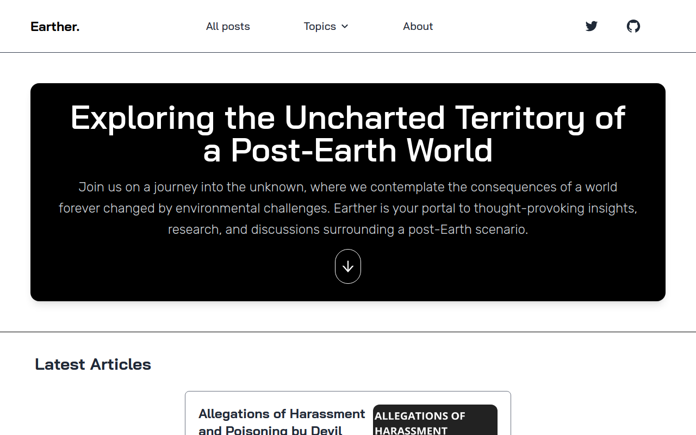

# Earther

## Overview

Earther is a repository dedicated to exploring and documenting the potential consequences of a post-Earth scenario. As our world faces various environmental challenges, it's essential to consider what might happen if the worst-case scenarios become a reality. This repository serves as a resource for researchers, scientists, and anyone interested in understanding the potential outcomes of such a scenario.

## Table of Contents

- [Introduction](#introduction)
- [Consequences](#consequences)
- [Contributing](#contributing)
- [License](#license)

## Introduction

In the face of climate change, habitat destruction, and other pressing environmental issues, it's vital to examine what could transpire in a post-Earth future. Earther aims to collect and curate information, research findings, and speculative scenarios related to the consequences of a world where Earth's ecosystem is significantly altered or destroyed.

## Consequences

This section will contain detailed information on various consequences of a post-Earth scenario. It will include topics such as:

- Ecological Changes: Explore how ecosystems would adapt or collapse.
- man Survival: Discuss the challenges and potential solutions for man survival.
- Technological Solutions: Investigate innovations that might help mitigate the consequences.
- Ethical and Philosophical Considerations: Delve into the ethical dilemmas and moral questions raised by a post-Earth world.

Feel free to contribute by adding your own research findings, articles, or thoughts to this repository. By collaboratively exploring these consequences, we hope to promote awareness and inspire action to prevent such a scenario.

## Contributing

We welcome contributions from researchers, scientists, writers, and anyone interested in the topic. To contribute:

1. Fork this repository.
2. Create a new branch for your changes: `git checkout -b feature/your-contribution`.
3. Make your changes and document them.
4. Test your changes if applicable.
5. Submit a pull request, explaining your contributions and changes.

Please follow our [Contribution Guidelines](CONTRIBUTING.md) for more details on how to contribute effectively.

## License

This repository is licensed under the [MIT License](LICENSE). By contributing to this project, you agree that your contributions will be licensed under this license.

Thank you for your interest in exploring the consequences of a post-Earth scenario with us. Together, we can better understand the potential challenges and work towards a sustainable future.